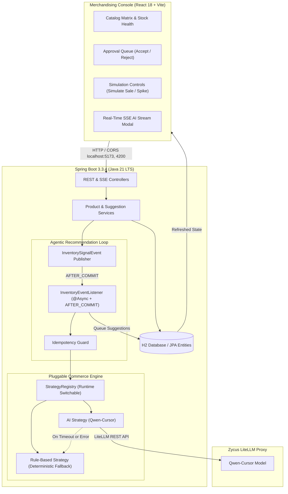

# StockPulse — AI Inventory & Dynamic Pricing Engine
> **Enterprise-grade, event-driven reactive commerce advisor for automated inventory signals, AI-powered dynamic pricing, and replenishment approvals.**

[](https://spring.io/projects/spring-boot)
[](https://adoptium.net)
[](https://vitejs.dev)
[](https://www.h2database.com)
[-red.svg)](https://litellm-qc.zycus.net)

---

## 🌟 Executive Summary

ShopStream sells hundreds of SKUs across **Electronics**, **Apparel**, and **Home Goods**. In traditional retail workflows, when stock drops critically low or viral demand spikes, merchandising teams debate adjustments in spreadsheets over email days too late.

**StockPulse** solves this problem through an autonomous **Agentic Recommendation Loop**:
1. **Signal Ingestion:** When inventory crosses a reorder threshold or demand velocity surges past category benchmarks, domain events fire automatically.
2. **AI Commerce Advisor:** Qwen-Cursor evaluates scarcity, price elasticity, and stock health via trigger-specific prompt engineering.
3. **Pluggable Commerce Engine:** Rule-based and AI-powered pricing/reorder strategies switchable at runtime with zero downtime.
4. **Human-in-the-Loop Checkpoint:** Merchandising console displays AI suggestions with confidence ratings, trigger badges, and accept/reject controls. Live prices and inventory levels never mutate without human authorization.
5. **SSE Token Streaming (Bonus +5 Pts):** Real-time streaming of AI reasoning tokens directly into the console.

---

## 🏗️ System Architecture



---

## 📋 Technology Stack & Versions Verified

| Layer | Component | Version | Verification / Notes |
|---|---|---|---|
| **Runtime** | Java JDK | **21.0.12.1+1 LTS** (Eclipse Temurin) | Installed in `C:\Users\poweroot\jdk-21.0.12.1+1`, validated `javac` & `java` |
| **Framework** | Spring Boot | **3.3.4** (3.x) | Web, Data JPA, Validation, Lombok, Starter Test |
| **Build Tool** | Apache Maven | **3.9.16** / `mvnw.cmd` | Wrapper auto-detects JDK 21 |
| **Database** | H2 In-Memory | **2.2.224** (with PostgreSQL driver) | Console at `/h2-console`, compatible with Postgres |
| **Frontend** | React + Vite | **React 18.3.1**, **Vite 8.3.1** | Native CSS Glassmorphism design system (no Tailwind) |
| **CORS** | Allowed Origins | `localhost:5173`, `localhost:4200` | Configured in `WebConfig.java` & `application.properties` |
| **AI Gateway** | Zycus LiteLLM | Model `qwen-cursor` | Connected with bearer token, product header, & cookie |

---

## 🚀 Quick Start Guide (< 5 Minutes)

### Prerequisites
- JDK 21 (installed at `C:\Users\poweroot\jdk-21.0.12.1+1` or configured in system `JAVA_HOME`)
- Node.js 18+ and npm

### 1. Start Backend (Port 8080)
```powershell
cd c:\Users\poweroot\Documents\DynamicPricing\backend
.\mvnw.cmd spring-boot:run
```
*Backend initializes H2 database and seeds the 8 Addendum A benchmark products.*

### 2. Start Frontend Console (Port 5173)
```powershell
cd c:\Users\poweroot\Documents\DynamicPricing\frontend
npm.cmd run dev
```
*Access the console in your browser at: **`http://localhost:5173`***

---

## 🎯 Demo Walkthrough Paths

### Path 1: Trigger A — Low Inventory Threshold
1. Open the UI at `http://localhost:5173`.
2. Inspect **`PRD-003` (Organic Cotton T-Shirt)**: Seeded with Stock = 8, Reorder Threshold = 15. It already shows an auto-generated suggestion in the **Approval Queue**.
3. Alternatively, click **"Simulate Sale"** on **`PRD-001` (Wireless Earbuds Pro)**:
   - Initial stock is 45 (threshold is 20).
   - Simulate a sale of 30 units (stock drops to 15).
   - Within sub-seconds, the **Agentic Loop** triggers in the background (`@Async`).
   - The LLM examines the inventory scarcity and queues:
     - **Pricing Suggestion**: e.g., Increase price to `$87.99` with clear merchandising reasoning.
     - **Reorder Suggestion**: e.g., Replenish `85` units.
4. Click **"Accept"** on the pricing suggestion → Live price updates to `$87.99` immediately.
5. Click **"Accept"** on the reorder suggestion → Stock immediately increases by the shipment amount.

### Path 2: Trigger B — Viral Demand Surge
1. Locate **`PRD-008` (Hoodie — Heather Grey)**: Initial demand velocity = 15. Category average = ~9.6.
2. Click **"Simulate Sale"** and purchase 25 units.
3. The demand velocity surges past the `3.0x` category threshold.
4. The Agentic Loop queues a suggestion with the amber badge: `DEMAND_SPIKE`.
5. The LLM explains how to capture consumer surplus without destroying demand momentum.

### Path 3: Real-Time AI Streaming (Bonus +5 Pts)
1. On any catalog item, click the **"⚡ Stream AI"** button.
2. An interactive modal opens connecting to `GET /api/products/{id}/suggest-pricing/stream`.
3. Watch the reasoning tokens stream in real-time as the Qwen-Cursor LLM deliberates.

### Path 4: Zero-Downtime Strategy Hot-Swap
1. In the top navigation bar, toggle the strategy badge between **AI Powered** and **Rule Based**.
2. Trigger any sale or on-demand suggestion. The system immediately executes the selected strategy without an application restart.

---

## 📡 REST API & cURL Cheatsheet

### 1. Get Catalog Matrix
```bash
curl -X GET "http://localhost:8080/api/products"
```

### 2. Simulate a Sale (Order Decrement + Velocity Bump)
```bash
curl -X POST "http://localhost:8080/api/products/PRD-001/orders" \
  -H "Content-Type: application/json" \
  -d '{"quantity": 30}'
```

### 3. Update Stock Level Directly
```bash
curl -X PATCH "http://localhost:8080/api/products/PRD-001/stock" \
  -H "Content-Type: application/json" \
  -d '{"newStock": 10}'
```

### 4. On-Demand Pricing Suggestion
```bash
curl -X POST "http://localhost:8080/api/products/PRD-001/suggest-pricing" \
  -H "Content-Type: application/json" \
  -d '{"triggerReason": "MANUAL"}'
```

### 5. On-Demand Reorder Suggestion
```bash
curl -X POST "http://localhost:8080/api/products/PRD-001/suggest-reorder" \
  -H "Content-Type: application/json" \
  -d '{"triggerReason": "MANUAL"}'
```

### 6. Accept / Reject Pricing Suggestion
```bash
curl -X PATCH "http://localhost:8080/api/pricing-suggestions/1" \
  -H "Content-Type: application/json" \
  -d '{"status": "ACCEPTED"}'
```

### 7. Accept / Reject Reorder Suggestion
```bash
curl -X PATCH "http://localhost:8080/api/reorder-suggestions/1" \
  -H "Content-Type: application/json" \
  -d '{"status": "ACCEPTED"}'
```

### 8. Runtime Strategy Hot-Switch
```bash
curl -X POST "http://localhost:8080/api/strategy" \
  -H "Content-Type: application/json" \
  -d '{"mode": "RULE_BASED"}'
```

### 9. Real-Time AI Token Stream (SSE Bonus)
```bash
curl -N -X GET "http://localhost:8080/api/products/PRD-001/suggest-pricing/stream"
```

---

## 🧪 Test Suite

All 7 backend tests pass cleanly, verifying:
- Rule-based pricing logic under inventory scarcity and demand surge.
- Rule-based replenishment formulas.
- Runtime strategy switching without restart.
- End-to-end agentic loop triggering, `@Async` execution, and idempotency guards.

To run tests:
```powershell
cd backend
.\mvnw.cmd test
```

---

## 🏛️ Architecture Decisions & Rubric Mapping

See [ADR.md](ADR.md) for full context, options, decisions, and tradeoffs covering:
- **ADR-001:** Separation of commerce logic into dedicated strategy contracts.
- **ADR-002:** Modular split contracts for pricing and reorder prompts.
- **ADR-003:** Zero-downtime runtime strategy switching via `StrategyRegistry`.
- **ADR-004:** Multi-layer LLM resilience, guardrails, and deterministic fallback.
- **ADR-005:** Transactional decoupling with `AFTER_COMMIT` event listener and idempotency.
- **ADR-006:** Sprint 2/3 extensibility seams (`costPrice`, `marginFloor`, `supplierId`).
